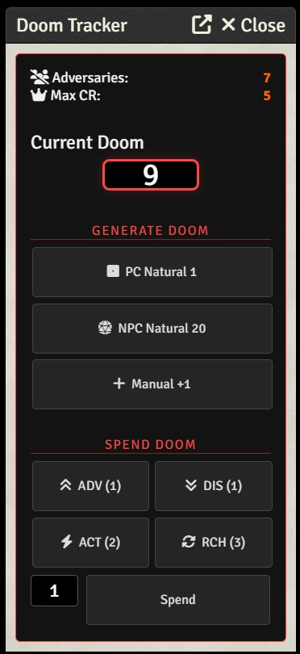
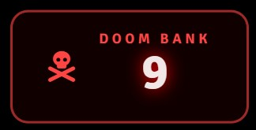

# Black Flag Doom Panel

A dedicated GM tool for the **Tales of the Valiant / Black Flag Roleplaying** system in Foundry VTT. This module tracks the Doom Bank, automates generation rules, and provides a dramatic player-facing overlay.

### Doom Panel
Monitor Max CR, how many enemies at a glance.

### Doom Bank Overlay
Build tension with always visible Doom Bank. 

## Features
- **GM Doom Panel**: Track adversaries and Max CR in current combat.
- **Automated Generation**: Buttons to quickly add Doom for PC Natural 1s or NPC Natural 20s.
- **Spending Logic**: Standard spend costs (Advantage, Extra Action, etc.) are built-in.
- **Doomsday Overlay**: A glass-style HUD for players to see the impending threat.
- **Dramatic Audio**: Optional sound effects for gaining and spending Doom.

## Installation
To install, copy the following manifest URL into the **Install Module** dialog in the Foundry VTT setup menu:

`https://github.com/ghost00-Ricgames/black-flag-doom-panel/raw/main/module.json`

## Usage
- **GM**: The panel opens automatically when a Combat starts.
- **Players**: The overlay is visible to all players when Doom is active, ensuring everyone feels the tension.

## License
MIT License - see [LICENSE](LICENSE) for details.
